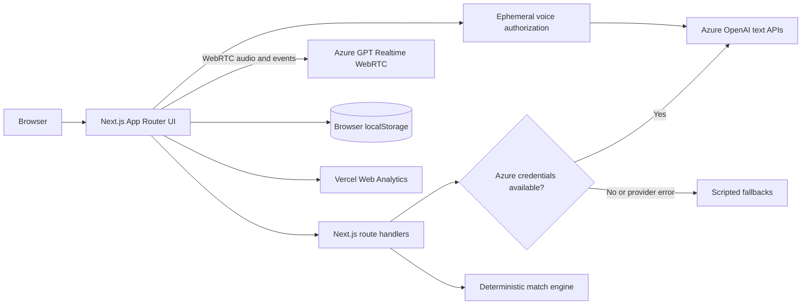

# The Intention Engine

**A customer-first exploration of therapy discovery: helping people turn
"something feels off" into a clearer, user-owned understanding of what support
could fit.**

[Open the live prototype](https://headway-companion-project.vercel.app) |
[Read the changelog](CHANGELOG.md)

> [!IMPORTANT]
> This is an unofficial, non-clinical product prototype. It is not affiliated
> with or endorsed by [Headway](https://headway.co), does not use real provider
> inventory, and does not complete a real appointment booking. Do not enter real
> health information or other sensitive personal data.

## Start with the person, not the taxonomy

The customer this concept is designed for knows they may want therapy, but may
not yet have the language to describe a diagnosis, modality, or ideal working
style. A filter-led experience asks them to translate their life into clinical
categories before the product has earned that precision.

The Intention Engine starts one step earlier. Huey, a warm and explicitly
non-clinical companion, helps a person reflect in their own words. The product
then turns that conversation into an inspectable summary, asks for consent
before moving forward, and uses the person's stated needs to explain
illustrative provider matches.

The product wager is simple: **better matching begins with better
understanding, and that understanding should remain legible and owned by the
person it describes.**

## The customer journey

`Find care -> Get oriented -> Reflect -> Confirm -> Understand -> Choose -> Keep`

| Moment | Customer need | Prototype response |
| --- | --- | --- |
| Find care | "Can I start with the constraints I already know?" | ZIP and insurance establish the initial marketplace constraints. |
| Get oriented | "What is about to happen?" | A short interstitial explains the experience and shows an explicitly simulated local provider count. |
| Reflect | "I know something is wrong, but I do not know how to begin." | Huey opens the conversation, streams responses, and offers starter prompts that summon help rather than prefill an answer. |
| Confirm | "Do not decide that I am finished for me." | The experience asks whether the person is ready for a summary or wants to keep talking. |
| Understand | "Show me what you heard, in language I recognize." | A structured reflection, priorities, and working-style spectrums are surfaced and can be corrected through chat. |
| Choose | "Explain why someone may fit, including the trade-offs." | Deterministic filters and scoring rank fictional providers; the UI explains fit, constraints, availability, and a simulated booking choice. |
| Keep | "Let me carry this understanding forward." | A user-owned Intention is saved on the device and framed as something the person may bring into care if they choose. |

## Capability boundaries

Clear boundaries are part of the product, especially in a sensitive domain.

| Capability | Status | Boundary |
| --- | --- | --- |
| Companion conversation | Implemented | Uses Azure OpenAI when configured and a scripted fallback otherwise. Huey is not a therapist or crisis service. |
| Realtime voice conversation | Implemented behind flags | Uses browser-to-Azure WebRTC, server VAD, and live transcription when separately enabled and configured. It is not a crisis service and falls back quietly to text. |
| Summary and refinement | Implemented | Produces a reflection, priorities, and working-style spectrums; it does not diagnose or recommend treatment. |
| Provider matching | Simulated | Runs deterministic filtering and scoring over 14 fictional provider records using an approximate ZIP-to-state mapping. It does not establish clinical suitability or real network eligibility. |
| Availability and booking | Simulated | Dates and times are generated deterministically from mock provider availability. No external scheduling system is contacted. |
| Intention persistence | Implemented locally | Saves context, summary, selected provider, and simulated booking to browser `localStorage`. There is no account sync, export, or sharing workflow. |
| Safety experience | Prototype | Uses US crisis resources, model classification when configured, and heuristic fallback detection. It has not received production clinical validation. |
| Authentication, billing, and marketplace operations | Not implemented | There is no account system, database, payment flow, real provider inventory, or real booking. |

The Headway-inspired homepage shell contains illustrative marketplace and
pricing copy. This repository does not establish those figures as current
Headway facts.

## The Product Principles

1. **Expression over taxonomy** — we meet the patient in their own words. The entry point
   is a quiet, natural-language conversation; the system does the work of translating
   context into matching criteria behind the scenes.
2. **Co-authored understanding** — no black-box matching. What the AI infers is surfaced
   as tactile, malleable **priority cards** the patient can rank, edit, or discard, each
   anchored to a phrase they actually said.
3. **Transparency is trust** — we replace filter sidebars with human **spectrums**
   (Action-oriented ↔ Space-holding) and surface real marketplace trade-offs. The
   UI explains meaningful choices around timing, working style, and care priorities
   without treating insurance coverage or provider licensure as negotiable.
4. **Context is connection** — the intake becomes a persistent **Intention** artifact: it
   belongs to the patient, can be shared with a therapist if they choose, and stays an
   updatable compass for the patient.

A fifth, non-negotiable layer — **duty of care** — runs an always-on "Get help now"
affordance (a focused resource panel in the header) and a tiered crisis-detection
model that gently weaves crisis resources into the companion's own reply, in
conversational flow, rather than interrupting with a popup.

## Why this palette

The chat palette is not only a visual reference to Headway. It is designed as
**emotional pacing**: a progression from openness, through reflection, toward
grounded agency. Meaning comes from how colors are assigned to interaction
roles, not from the claim that any hue creates a universal emotional response.

| Palette | Interface role | Emotional intent |
| --- | --- | --- |
| Sky and air blues (`#DCEBF7`, `#EEF6FB`) | Upper canvas and opening conversation | Spaciousness and permission to begin without pressure |
| Warm near-whites (`#FBFCF8`, `#FBFEFD`) | Reading and reflection surfaces | Neutrality without the perceived sterility of clinical white |
| Soft mint (`#DFF2E7`) | User messages, summaries, and supportive states | Containment, ownership, and gentle forward movement |
| Deep forest green (`#14603B`, `#0F4D2F`) | Primary actions and progress | Grounded confidence; decisive without feeling aggressive |
| Warm ink (`#1C1D1A`, `#52635D`) | Primary and supporting text | Seriousness and credibility without relying on pure black |
| Muted rust (`#B4472F`, `#F6E9E4`) | Safety-only states | Urgency and gravity without flooding the experience with alarm |

The canvas moves vertically from cool sky blue through quiet near-white into a
faint yellow-green near the composer. That arc mirrors the intended journey:
arrive with uncertainty, gain room to reflect, and leave with greater agency.
The person's words sit inside a mint container while Huey speaks directly on
the canvas, making the person's contribution feel held without presenting the
companion as another human or clinical authority.

Color psychology is contextual and culturally variable. The defensible design
claim is that this low-saturation system reduces visual intensity and creates a
clear emotional hierarchy, not that blue or green clinically causes calm. The
palette should ultimately be validated with the people the experience is
designed to support.

### Accessibility note

Core text and action combinations measure between **5.82:1 and 16.69:1**; the
alert pair measures **4.56:1**. These meet WCAG AA contrast targets for normal
text. Current hairlines and the feather-colored focus border measure between
**1.38:1 and 2.41:1**, making stronger component and focus boundaries a known
accessibility improvement. Safety and availability states pair color with text
and icons rather than relying on color alone.

## Architecture and data flow



Text AI calls pass through server-side route handlers. When the separately
flagged voice mode is enabled, the server only mints a short-lived client secret;
the browser then sends WebRTC media directly to the configured Azure Realtime
resource. The Azure resource key never enters the browser, and long-lived audio
does not traverse the Next.js server.

### Responsibility split

| Touchpoint | Route | Responsibility |
| --- | --- | --- |
| Companion conversation | `POST /api/chat` | Streams NDJSON model deltas or a paced scripted fallback, followed by explicit completion metadata. |
| Voice authorization | `POST /api/realtime/session` | Mints a short-lived Azure client secret and supplies the direct WebRTC call URL; it never proxies media. |
| Safety classification | `POST /api/safety` | Produces a tier 0-3 assessment with structured model output or heuristic fallback detection. |
| Understanding | `POST /api/synthesize` | Produces a Zod-validated reflection, priorities, and spectrums or a deterministic fallback synthesis. |
| Summary correction | `POST /api/refine` | Revises the structured understanding from conversational feedback. |
| Provider matching | `POST /api/match` | Runs deterministic hard filters and weighted scoring, then uses the model or fallback code only to explain the result. |

Provider filtering and scoring live in `lib/providers.ts`:

- **Hard constraints:** selected insurance and approximate
  ZIP-to-state/in-person eligibility
- **Soft fit:** 55% focus-area overlap, 37% working-style similarity, plus a
  small availability adjustment
- **Transparency:** deterministic match reasons and trade-off copy highlight
  availability, working-style, or priority differences within the eligible matches

## Safety, privacy, and data handling

### Safety

- An always-available **Get help now** action exposes 988, Crisis Text Line, and
  911 resources for people in the US.
- Each user turn is classified on a four-tier safety scale. Azure structured
  output is used when configured; otherwise a keyword-based fallback runs.
- Summary transitions wait for outstanding safety checks and do not advance on
  a flagged turn.
- The classifier, fallback heuristics, copy, and interaction design are
  prototypes. They have not received clinical review or production validation.
- This product is not a crisis service. In the US, call or text **988** for
  crisis support or call **911** for immediate danger.

### Data flow

| Data | Where it goes | App-level persistence |
| --- | --- | --- |
| Conversation text | Next.js API routes; forwarded to Azure OpenAI only when live credentials are configured | No application database |
| Voice audio | Direct browser-to-Azure WebRTC while a call is active | Not stored by this application; tracks and playback objects are released when the call ends |
| ZIP, insurance, summary, preferences, chosen fictional provider, and simulated booking | Browser only after the Intention is saved | Unencrypted `localStorage` until browser storage is cleared or the experience is restarted |
| Page-level usage telemetry | Vercel Web Analytics is mounted globally | Governed by the configured Vercel project |

The absence of a database does **not** mean no data leaves the browser:
conversation text reaches the deployed server and may reach Azure OpenAI in live
mode. Infrastructure logging, retention, residency, consent, and deletion
requirements would need explicit review before any production use.

### AI activity diagnostics

Chat responses, summary creation and refinement, and therapist matching emit
one-line lifecycle logs with a correlation ID. The activity names are
`companion-response`, `summary-creation`, `summary-refinement`, and
`therapist-matching`; each records a `request` event followed by `done` or an
explicit error/fallback event. Chat also records `first-output`, making a request
that never produced visible text distinguishable from an interrupted partial
response.

Each route returns an internal `x-request-id` header. Chat additionally sends an
NDJSON stream of `delta`, `done`, or `error` events and is successful only after
its `done` event arrives. A Vercel timeout appears as a `request` with no
application terminal event followed by the platform runtime-timeout log.

For diagnosis, use the approximate time of the activity and inspect the local
terminal or the Vercel project's **Logs** view:

```bash
vercel logs --project headway-companion-project --environment production --since 30m --no-branch --expand
```

Logs contain only operational metadata such as request ID, lifecycle event,
mode, input/output counts, fallback reason, error type, and elapsed time. They do
not contain conversation text, generated summaries, ZIP codes, insurance,
provider names, or match explanations.

## Run locally

### Prerequisites

- Node.js **20.9.0 or newer**
- npm

```bash
git clone https://github.com/allanc92/Headway-Companion-Project.git
cd Headway-Companion-Project
npm ci
npm run dev
```

Open <http://localhost:3000>. No Azure configuration is required; the app uses
scripted fallbacks when credentials are absent.

### Enable Azure OpenAI

Copy `.env.example` to `.env.local`:

```bash
# macOS or Linux
cp .env.example .env.local
```

```powershell
# Windows PowerShell
Copy-Item .env.example .env.local
```

Then configure the deployment:

| Variable | Required | Description |
| --- | --- | --- |
| `AZURE_API_KEY` | Yes | Azure OpenAI resource key |
| `AZURE_DEPLOYMENT_NAME` | Yes | Name of the model deployment |
| `AZURE_RESOURCE_NAME` | One of resource or base URL | Resource name before `.openai.azure.com` |
| `AZURE_BASE_URL` | One of resource or base URL | Full endpoint when a custom base URL is needed |
| `AZURE_API_VERSION` | No | Classic deployment API version; `.env.example` contains an example, not a compatibility guarantee |
| `AZURE_USE_V1_API` | No | Set to `true` to use `/openai/v1` instead of deployment-based URLs |
| `VOICE_ENABLED` | Yes for voice | Server-side voice gate; defaults to `false` |
| `NEXT_PUBLIC_VOICE_ENABLED` | Yes for voice | Build-time UI gate; defaults to `false` |
| `AZURE_REALTIME_DEPLOYMENT` | Yes for voice | Azure deployment name targeting `gpt-realtime-2` where available |
| `AZURE_REALTIME_TRANSCRIPTION_DEPLOYMENT` | Yes for voice | Existing Azure speech-to-text deployment name used for canonical user captions |
| `AZURE_REALTIME_VOICE` | No | Realtime output voice; defaults to `marin` |
| `AZURE_REALTIME_ENDPOINT` | No | Full Azure resource endpoint when it differs from the text resource |

Azure Realtime uses the GA `/openai/v1/realtime/client_secrets` and
`/openai/v1/realtime/calls` endpoints. Do not add an `api-version` or use the
deprecated preview session endpoint. Both feature flags must be `true`; otherwise
the existing text experience is unchanged.

Restart `npm run dev` after changing `.env.local`. The file is gitignored; never
commit real credentials.

## Validation status

```bash
npm run lint
npx tsc --noEmit --incremental false
npm run build
```

The repository currently has no automated test suite or CI workflow. Linting and
a production build are the available project checks; clinical, accessibility,
privacy, and user validation remain separate requirements.

## Deploy on Vercel

[](https://vercel.com/new/clone?repository-url=https%3A%2F%2Fgithub.com%2Fallanc92%2FHeadway-Companion-Project&env=AZURE_RESOURCE_NAME,AZURE_API_KEY,AZURE_DEPLOYMENT_NAME,AZURE_API_VERSION&envDescription=Azure%20OpenAI%20credentials%20are%20optional%3B%20the%20app%20uses%20fallback%20mode%20without%20them)

The repository's `vercel.json` pins the framework to Next.js so both page and
API routes use the expected runtime.

1. Import the repository into Vercel.
2. Add the `AZURE_*` variables under **Project Settings > Environment
   Variables**, or omit them to use fallback mode.
3. Review Analytics, logging, privacy, and retention settings for the target
   environment.
4. Deploy.

The current public deployment is
<https://headway-companion-project.vercel.app>. Its Azure configuration is not
asserted by this README.

## Project map

```text
app/
  page.tsx                         Headway-inspired entry and Find Care form
  getting-started/page.tsx         Orientation interstitial
  intake/page.tsx                  Conversation and inline post-chat journey
  api/
    chat/route.ts                  Streaming companion
    realtime/session/route.ts      Ephemeral Realtime client secrets
    safety/route.ts                Tiered safety classification
    synthesize/route.ts            Structured understanding
    refine/route.ts                Conversational summary correction
    match/route.ts                 Matching plus fit explanations
components/
  home/                            Entry experience and hero
  interstitial/                    Getting Started experience
  intake/                          Chat, summary, matches, booking, Intention
lib/
  azure.ts                         Credential gate and model provider
  realtime.ts                      Server-only Realtime configuration
  realtime-events.ts               Typed GA event reduction
  prompts.ts                       Companion, synthesis, and safety prompts
  providers.ts                     Fictional providers and match engine
  booking.ts                       Deterministic mock availability
  fallback.ts                      No-credential and provider-error behavior
  intention-store.ts              Browser-local persistence
  signal.ts                        Conversation progression safety nets
  copy.ts                          Client-facing copy and US crisis resources
CHANGELOG.md                       Product and engineering history
```

## Project status

This repository is a focused product and engineering prototype, not a production
healthcare service. No license or formal contribution process has been
established; source visibility should not be interpreted as permission to reuse
the code or assets.

See [CHANGELOG.md](CHANGELOG.md) for the product and engineering history.

## Trademark and representation

Headway and related marks belong to their respective owners. This independent
prototype uses a brand-inspired interface to explore a product concept and is
not an authoritative representation of Headway's current product, marketplace,
pricing, provider network, or clinical practices.
